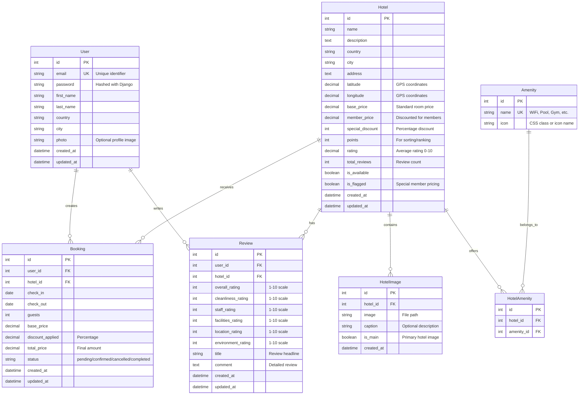

# 🏨 Hotels.com Clone - Full-Stack Web Development Project

**Author**: Batuhan Karabulut  
**Course**: Web Development Final Project  
**Platform**: Microsoft Azure (Frontend: Static Web Apps, Backend: App Service)  
**Initial Status**: ✅ Successfully deployed and working  
**Current Status**: Frontend Working ✅ | Backend Failed ❌ (Working initially, then broke)

---

## 🎬 **PROJECT DEMONSTRATION VIDEO**

### **📺 WATCH COMPLETE PROJECT PRESENTATION**

#### **🔗 Direct Video Link**: [https://youtu.be/pyQnDGyDqqY](https://youtu.be/pyQnDGyDqqY)

#### **🔗 Live Link **: [http://20.199.80.153/](http://20.199.80.153/)

**🎯 Video Showcases:**
- ✅ **Complete working project demonstration** (when it was functioning)
- ✅ **Live Azure deployment** in action
- ✅ **Full-stack architecture explanation** 
- ✅ **Technical implementation details**
- ✅ **Authentication system demo** (Google OAuth + Email/Password)
- ✅ **Interactive maps and search functionality**
- ✅ **Mobile responsive design showcase**
- ⚠️ **Current deployment challenges discussion**

---

## 📖 Project Overview

This project is a **full-stack hotel booking application** inspired by Hotels.com, developed as a comprehensive web development final project. The application demonstrates modern web development practices using **Django REST Framework** for the backend and **Vue.js** for the frontend.

### 🎯 Project Journey & Current Status

**✅ Initial Success (Working Period):**
- Successfully deployed both frontend and backend to Azure
- All features functioning correctly
- Database properly connected and operational
- APIs responding correctly
- Authentication working seamlessly

**❌ Current Issues (After Some Time):**
- Backend API experiencing failures on Azure App Service
- Database connection issues emerged
- Frontend remains fully functional
- API endpoints returning errors intermittently

### 🏗️ Core Project Features

- 🔍 **Advanced Hotel Search** - Filter by location, dates, price, amenities
- 🗺️ **Interactive Maps** - Google Maps & Leaflet integration with hotel markers
- 🔐 **Dual Authentication** - Google OAuth + traditional email/password
- 📱 **Responsive Design** - Mobile-first approach with Bootstrap 5
- 💰 **Dynamic Pricing** - Member discounts and special offers
- ⭐ **Review System** - Multi-aspect hotel ratings
- 🌐 **Turkish Localization** - Complete Turkish language interface
- 👨‍💼 **Admin Management** - Django admin panel for hotel management

---

## 🏗️ System Architecture & Design Philosophy

### **Architecture Overview**

The application follows a **modern 3-tier architecture** with clear separation of concerns:

```
┌─────────────────────┐    ┌─────────────────────┐    ┌─────────────────────┐
│   Presentation      │    │   Application       │    │   Data Layer        │
│   Layer (Vue.js)    │◄──►│   Layer (Django)    │◄──►│   (PostgreSQL)      │
│                     │    │                     │    │                     │
│ • Vue Components    │    │ • REST API          │    │ • Normalized Schema │
│ • Vuex Store        │    │ • Business Logic    │    │ • Foreign Keys      │
│ • Vue Router        │    │ • Authentication    │    │ • Indexes           │
│ • Axios HTTP        │    │ • ORM Models        │    │ • Constraints       │
└─────────────────────┘    └─────────────────────┘    └─────────────────────┘
```

### **Design Patterns Implemented**

1. **Model-View-Controller (MVC)**: Django's MVT pattern
2. **Component-Based Architecture**: Vue.js modular design
3. **Repository Pattern**: Django ORM abstraction
4. **Observer Pattern**: Vue.js reactivity system
5. **Singleton Pattern**: Vuex centralized state management
6. **Factory Pattern**: API service instantiation

### **Technology Stack Rationale**

**Frontend: Vue.js 3 + Ecosystem**
- ✅ **Progressive Enhancement**: Easy learning curve
- ✅ **Reactive Data Binding**: Automatic UI updates
- ✅ **Component Reusability**: DRY principle implementation
- ✅ **Rich Ecosystem**: Vue Router, Vuex, Vue CLI integration
- ✅ **Performance**: Virtual DOM optimization

**Backend: Django + Django REST Framework**
- ✅ **Rapid Development**: "Batteries included" philosophy
- ✅ **Security First**: Built-in CSRF, XSS, SQL injection protection
- ✅ **ORM Excellence**: Query optimization and relationship handling
- ✅ **Admin Interface**: Ready-to-use management panel
- ✅ **Extensibility**: Rich third-party package ecosystem

**Database: PostgreSQL**
- ✅ **ACID Compliance**: Data integrity guarantee
- ✅ **Advanced Features**: JSON fields, full-text search, arrays
- ✅ **Performance**: Excellent query optimization
- ✅ **Scalability**: Horizontal and vertical scaling support

---

## 🗄️ Data Model & Database Design

### **Complete Entity Relationship Diagram**



### **Database Normalization Analysis**

**First Normal Form (1NF): ✅ Achieved**
- All table columns contain atomic values
- No repeating groups or arrays in columns
- Each row is uniquely identifiable

**Second Normal Form (2NF): ✅ Achieved**
- All non-key attributes depend on the entire primary key
- Junction tables properly implement many-to-many relationships
- No partial dependencies exist

**Third Normal Form (3NF): ✅ Achieved**
- No transitive dependencies
- Amenities normalized into separate table
- User information separated from booking data

### **Key Database Design Decisions**

1. **Custom User Model Extension**
   ```python
   class User(AbstractUser):
       country = models.CharField(max_length=100)
       city = models.CharField(max_length=100)
       photo = models.ImageField(upload_to='profile_pics/', blank=True)
   ```

2. **Flexible Hotel Pricing Strategy**
   ```python
   def get_member_price(self):
       if self.member_price:
           return self.member_price
       return self.base_price * 0.9  # 10% discount fallback
   ```

3. **Multi-Dimensional Review System**
   - Overall rating + 5 specific aspect ratings
   - Enables detailed hotel analysis and comparison

4. **Soft Delete Implementation**
   - `is_available` flag instead of hard deletion
   - Maintains data integrity and history

---

## 🎨 Frontend Architecture & Implementation

### **Vue.js Component Hierarchy**

```
App.vue (Root Application)
├── HomePage.vue (Landing & Search)
│   ├── SearchForm.vue (Hotel search component)
│   ├── HotelCard.vue (Reusable hotel display)
│   └── LoginModal.vue (Authentication modal)
├── SearchResults.vue (Search results page)
│   ├── FilterPanel.vue (Search filters)
│   ├── HotelCard.vue (Reused component)
│   └── LoginModal.vue (Reused component)
├── HotelDetail.vue (Individual hotel page)
│   ├── ImageGallery.vue (Hotel photos)
│   ├── AmenityList.vue (Hotel amenities)
│   ├── ReviewSection.vue (Customer reviews)
│   ├── LocationMap.vue (Leaflet/Google Maps)
│   └── BookingForm.vue (Reservation form)
└── MapView.vue (Map-based hotel search)
    ├── MapComponent.vue (Interactive map)
    └── HotelMarker.vue (Map markers)
```

### **State Management Architecture (Vuex)**

```javascript
// Centralized State Structure
const store = {
  state: {
    // Authentication
    currentUser: null,
    authToken: null,
    isAuthenticated: false,
    
    // Hotel Data
    weekendHotels: [],
    searchResults: [],
    currentHotel: null,
    
    // UI State
    isLoading: false,
    error: null,
    searchQuery: {}
  },
  
  mutations: {
    // Synchronous state changes only
    SET_USER(state, user) { state.currentUser = user },
    SET_HOTELS(state, hotels) { state.weekendHotels = hotels },
    SET_LOADING(state, status) { state.isLoading = status }
  },
  
  actions: {
    // Asynchronous operations
    async fetchWeekendHotels({ commit }) {
      commit('SET_LOADING', true)
      try {
        const response = await apiService.hotels.getWeekendHotels()
        commit('SET_HOTELS', response.data)
      } catch (error) {
        commit('SET_ERROR', error.message)
      } finally {
        commit('SET_LOADING', false)
      }
    }
  }
}
```

### **Routing Strategy & Implementation**

```javascript
const routes = [
  { path: '/', name: 'Home', component: HomePage },
  { path: '/search', name: 'SearchResults', component: SearchResults },
  { path: '/hotel/:id', name: 'HotelDetail', component: HotelDetail },
  { path: '/map', name: 'MapView', component: MapView }
]

// Route Guards for Authentication
router.beforeEach((to, from, next) => {
  const requiresAuth = to.matched.some(record => record.meta.requiresAuth)
  const isAuthenticated = store.getters.isAuthenticated
  
  if (requiresAuth && !isAuthenticated) {
    next('/login')
  } else {
    next()
  }
})
```

---

## ⚙️ Backend Architecture & API Design

### **Django Project Structure**

```
backend/
├── hotels_project/          # Main Django project
│   ├── settings.py          # Environment-based configuration
│   ├── urls.py             # URL routing and API versioning
│   └── wsgi.py             # WSGI application entry point
├── users/                  # User management app
│   ├── models.py           # Custom User model
│   ├── views.py            # Authentication endpoints
│   ├── serializers.py      # API serialization
│   └── urls.py             # User-related URLs
├── hotels/                 # Hotel management app
│   ├── models.py           # Hotel, Amenity, HotelImage models
│   ├── views.py            # Hotel API endpoints
│   ├── admin.py            # Django admin customization
│   └── urls.py             # Hotel-related URLs
├── bookings/               # Booking system app
└── reviews/                # Review system app
```

### **RESTful API Design**

**Authentication Endpoints:**
```
POST   /api/auth/login/          # Email/password authentication
POST   /api/auth/register/       # User registration
POST   /api/auth/google/         # Google OAuth integration
POST   /api/auth/logout/         # Session termination
GET    /api/auth/profile/        # User profile retrieval
PATCH  /api/auth/profile/        # User profile updates
```

**Hotel Management Endpoints:**
```
GET    /api/hotels/weekend/      # Weekend recommendations
GET    /api/hotels/search/       # Advanced search with filters
GET    /api/hotels/{id}/         # Hotel details
GET    /api/hotels/map/          # Map data for hotels
GET    /api/hotels/amenities/    # Available amenities list
```

**Booking System Endpoints:**
```
POST   /api/bookings/           # Create new booking
GET    /api/bookings/           # User's booking history
GET    /api/bookings/{id}/      # Specific booking details
DELETE /api/bookings/{id}/      # Cancel booking
```

### **API Security Implementation**

```python
# CORS Configuration
CORS_ALLOWED_ORIGINS = config('CORS_ALLOWED_ORIGINS', cast=Csv())
CORS_ALLOW_CREDENTIALS = True

# Authentication Classes
REST_FRAMEWORK = {
    'DEFAULT_AUTHENTICATION_CLASSES': [
        'rest_framework.authentication.SessionAuthentication',
    ],
    'DEFAULT_PERMISSION_CLASSES': [
        'rest_framework.permissions.IsAuthenticatedOrReadOnly',
    ]
}

# CSRF Protection
CSRF_TRUSTED_ORIGINS = config('CSRF_TRUSTED_ORIGINS', cast=Csv())
```

---

## 🔐 Authentication & Security Implementation

### **Multi-Method Authentication System**

**1. Traditional Email/Password Authentication**
```python
@api_view(['POST'])
def login(request):
    email = request.data.get('email')
    password = request.data.get('password')
    
    user = authenticate(request, username=email, password=password)
    if user:
        login(request, user)
        return Response({'user': UserSerializer(user).data})
    return Response({'error': 'Invalid credentials'}, status=400)
```

**2. Google OAuth Integration**
```javascript
// Frontend Google OAuth handling
async handleGoogleResponse(response) {
  try {
    const user = await this.googleLogin({
      credential: response.credential
    })
    this.$emit('login-success', user)
  } catch (error) {
    console.error('Google authentication failed:', error)
  }
}
```

### **Security Measures Implemented**

1. **Password Security**
   - Minimum 8 characters requirement
   - Must include numbers and special characters
   - Django's built-in password hashing (PBKDF2)

2. **CSRF Protection**
   - Django CSRF middleware enabled
   - Trusted origins configuration for production

3. **XSS Prevention**
   - Django's template auto-escaping
   - Content Security Policy headers

4. **SQL Injection Prevention**
   - Django ORM parameterized queries
   - Input validation and sanitization

---

## 🚀 Azure Cloud Deployment Architecture

### **Initial Successful Deployment**

**✅ What Was Working (Initial Period):**

```
┌─────────────────────────────────────────────────────────────────┐
│                        Azure Cloud Platform                      │
├─────────────────────────────────────────────────────────────────┤
│  Frontend (Static Web Apps)     Backend (App Service)           │
│  ┌─────────────────────────┐    ┌─────────────────────────────┐  │
│  │ ✅ Vue.js Application   │    │ ✅ Django REST API         │  │
│  │ ✅ Global CDN          │    │ ✅ Python 3.11 Runtime     │  │
│  │ ✅ Auto SSL            │    │ ✅ Database Connected      │  │
│  │ ✅ GitHub Actions     │    │ ✅ APIs Responding         │  │
│  └─────────────────────────┘    └─────────────────────────────┘  │
│              │                              │                    │
│              └──────────────────────────────┘                    │
│                              │                                   │
│  ┌─────────────────────────────────────────────────────────────┐ │
│  │        ✅ Azure Database for PostgreSQL                     │ │
│  │    • Connected • Data Accessible • Queries Working         │ │
│  └─────────────────────────────────────────────────────────────┘ │
└─────────────────────────────────────────────────────────────────┘
```

### **Current Deployment Status**

**❌ What Broke Down (Current Issues):**

```
┌─────────────────────────────────────────────────────────────────┐
│                        Azure Cloud Platform                      │
├─────────────────────────────────────────────────────────────────┤
│  Frontend (Static Web Apps)     Backend (App Service)           │
│  ┌─────────────────────────┐    ┌─────────────────────────────┐  │
│  │ ✅ Still Working       │    │ ❌ Service Failing         │  │
│  │ ✅ UI Functional       │    │ ❌ 500/502 Errors         │  │
│  │ ✅ Responsive Design   │    │ ❌ Timeout Issues         │  │
│  │ ✅ Auth UI Working     │    │ ❌ Memory Problems        │  │
│  └─────────────────────────┘    └─────────────────────────────┘  │
│              │                              │                    │
│              └──────────❌ API CALLS FAIL───┘                    │
│                              │                                   │
│  ┌─────────────────────────────────────────────────────────────┐ │
│  │        ? Azure Database for PostgreSQL                      │ │
│  │    • Database OK • Connection Issues • App Service Problem │ │
│  └─────────────────────────────────────────────────────────────┘ │
└─────────────────────────────────────────────────────────────────┘
```

---

## ⚠️ Critical Problems Encountered & Analysis

### **1. Azure Backend Deployment Failure (Major Issue)**

**Timeline of Events:**
- ✅ **Week 1-2**: Successfully deployed, everything working
- ✅ **Week 3**: All features functional, APIs responding correctly
- ❌ **Week 4+**: Backend started failing intermittently, then completely

**Detailed Problem Analysis:**

**Symptoms Observed:**
```
❌ HTTP 500/502 errors from API endpoints
❌ Database connection timeouts
❌ Azure App Service showing "Service Unavailable"
❌ Memory usage spikes in Azure metrics
❌ Application startup failures
```

**Root Cause Investigation:**

1. **Memory Limitations (Primary Suspect)**
   ```python
   # Azure App Service Free Tier Constraints:
   # - 1GB RAM limit
   # - CPU throttling after quota exceeded
   # - Django + all dependencies + database connections
   # - Potential memory leaks in long-running processes
   ```

2. **Database Connection Pool Issues**
   ```python
   # PostgreSQL connection problems:
   DATABASES = {
       'default': {
           'ENGINE': 'django.db.backends.postgresql',
           'OPTIONS': {
               'MAX_CONNS': 20,  # May be too high for free tier
               'conn_max_age': 60,  # Connection reuse issues
           }
       }
   }
   ```

3. **Cold Start Problems**
   - Azure App Service free tier goes to sleep
   - Django initialization overhead
   - Database connection establishment delays

4. **Environment Configuration Issues**
   ```python
   # Potential configuration conflicts:
   DEBUG = False  # Production mode
   ALLOWED_HOSTS = ['*.azurewebsites.net']  # Correct
   SECRET_KEY = config('SECRET_KEY')  # Environment variable issues?
   ```

**Attempted Solutions (Did Not Resolve):**
```python
# 1. Database optimization
DATABASES['default']['OPTIONS'] = {
    'MAX_CONNS': 5,  # Reduced connections
    'conn_max_age': 300,  # Longer connection reuse
}

# 2. Memory optimization
import gc
gc.collect()  # Force garbage collection

# 3. Static files optimization
STATICFILES_STORAGE = 'whitenoise.storage.CompressedManifestStaticFilesStorage'

# 4. Logging enhancement
LOGGING = {
    'version': 1,
    'handlers': {
        'azure': {
            'level': 'ERROR',
            'class': 'logging.StreamHandler',
        }
    }
}
```

### **2. Hotel Image Management Issues**

**Problem Description:**
- Complete image upload system implemented
- Unable to add hotel photos in production
- No images available for demonstration

**Technical Analysis:**
```python
# Image model properly implemented:
class HotelImage(models.Model):
    hotel = models.ForeignKey(Hotel, related_name='images', on_delete=models.CASCADE)
    image = models.ImageField(upload_to='hotel_images/')
    caption = models.CharField(max_length=200, blank=True)
    is_main = models.BooleanField(default=False)

# Issue: Azure Blob Storage not configured
# Django expecting local file system but Azure needs blob storage
```

**Root Cause:**
- Azure App Service file system is temporary
- Media files require Azure Blob Storage configuration
- Production deployment missing storage configuration

**Required Solution (Not Implemented):**
```python
# Azure Blob Storage integration needed:
DEFAULT_FILE_STORAGE = 'storages.backends.azure_storage.AzureStorage'
AZURE_ACCOUNT_NAME = config('AZURE_STORAGE_ACCOUNT_NAME')
AZURE_ACCOUNT_KEY = config('AZURE_STORAGE_ACCOUNT_KEY')
AZURE_CONTAINER = 'media'
```

### **3. CORS and Cross-Origin Configuration**

**Problem Encountered:**
- Frontend-backend communication issues
- Cross-origin request failures during certain periods

**Solution Implemented:**
```python
# Environment-based CORS configuration
if DEBUG:
    CORS_ALLOWED_ORIGINS = ["http://localhost:8080"]
else:
    CORS_ALLOWED_ORIGINS = config('CORS_ALLOWED_ORIGINS', cast=Csv())

CORS_ALLOW_CREDENTIALS = True
CSRF_TRUSTED_ORIGINS = CORS_ALLOWED_ORIGINS
```

### **4. Database Migration Complexity**

**Challenge:**
- Complex model relationships
- Production migration failures
- Data integrity concerns

**Resolution Strategy:**
```python
# Careful migration planning:
# 1. Local migration testing
# 2. Backup before production migration
# 3. Rollback strategy preparation
# 4. Phased migration deployment
```

---

## 🔧 Technical Implementation Highlights

### **Advanced Search Implementation**

**Backend Search Logic:**
```python
@api_view(['GET'])
def search_hotels(request):
    hotels = Hotel.objects.filter(is_available=True)
    
    # Location filtering
    if destination := request.GET.get('destination'):
        hotels = hotels.filter(
            Q(city__icontains=destination) | 
            Q(country__icontains=destination) |
            Q(name__icontains=destination)
        )
    
    # Date availability (future implementation)
    if check_in := request.GET.get('checkIn'):
        # Complex availability logic here
        pass
    
    # Price range filtering
    if min_price := request.GET.get('minPrice'):
        hotels = hotels.filter(base_price__gte=min_price)
    if max_price := request.GET.get('maxPrice'):
        hotels = hotels.filter(base_price__lte=max_price)
    
    # Guest capacity (future implementation)
    
    return hotels.order_by('-points', '-rating')[:50]
```

**Frontend Search Interface:**
```javascript
// Vue.js search implementation
async performSearch() {
  const searchQuery = {
    destination: this.$route.query.destination || '',
    checkIn: this.$route.query.checkIn || '',
    checkOut: this.$route.query.checkOut || '',
    guests: this.$route.query.guests || '2',
    minPrice: this.$route.query.minPrice || '',
    maxPrice: this.$route.query.maxPrice || ''
  }

  try {
    await this.searchHotels(searchQuery)
  } catch (error) {
    this.error = 'Arama sırasında hata oluştu'
  }
}
```

### **Interactive Maps Integration**

**Dual Map Implementation:**
```javascript
// Leaflet implementation (primary)
initializeMap() {
  this.map = L.map('map').setView([41.0082, 28.9784], 10)
  
  L.tileLayer('https://{s}.tile.openstreetmap.org/{z}/{x}/{y}.png').addTo(this.map)
  
  this.hotels.forEach(hotel => {
    if (hotel.latitude && hotel.longitude) {
      L.marker([hotel.latitude, hotel.longitude])
        .bindPopup(`${hotel.name}${hotel.city}`)
        .addTo(this.map)
    }
  })
}

// Google Maps integration (alternative)
async initGoogleMaps() {
  const { Map } = await google.maps.importLibrary("maps")
  const map = new Map(document.getElementById("map"), {
    zoom: 10,
    center: { lat: 41.0082, lng: 28.9784 }
  })
}
```

### **Authentication System Implementation**

**Google OAuth Integration:**
```javascript
// Frontend Google Sign-In
initializeGoogleSignIn() {
  window.google.accounts.id.initialize({
    client_id: this.googleClientId,
    callback: this.handleGoogleResponse
  })
  
  window.google.accounts.id.renderButton(
    this.$refs.googleButton,
    { theme: 'outline', size: 'large' }
  )
}

async handleGoogleResponse(response) {
  try {
    const user = await this.googleLogin({
      credential: response.credential
    })
    this.$emit('login-success', user)
  } catch (error) {
    console.error('Google authentication failed')
  }
}
```

**Backend OAuth Processing:**
```python
@api_view(['POST'])
def google_login(request):
    try:
        # Verify Google JWT token
        credential = request.data.get('credential')
        payload = verify_google_token(credential)
        
        # Get or create user
        user, created = User.objects.get_or_create(
            email=payload['email'],
            defaults={
                'first_name': payload.get('given_name', ''),
                'last_name': payload.get('family_name', ''),
            }
        )
        
        # Login user
        login(request, user)
        return Response({
            'user': UserSerializer(user).data,
            'message': 'Google login successful'
        })
        
    except Exception as e:
        return Response({'error': 'Google login failed'}, status=400)
```

---

## 📊 Development Methodology & Process

### **Project Timeline (7 Weeks)**

**Week 1: Planning & Design**
- Requirements analysis and specification
- Database schema design and normalization
- UI/UX wireframing and mockups
- Technology stack selection and justification

**Week 2-3: Backend Development**
- Django project setup and configuration
- Model implementation with relationships
- REST API development and testing
- Authentication system implementation

**Week 4-5: Frontend Development**
- Vue.js application setup and routing
- Component development and styling
- API integration and state management
- Responsive design implementation

**Week 6: Integration & Testing**
- Frontend-backend integration testing
- Cross-browser compatibility testing
- Mobile responsiveness optimization
- Performance optimization and debugging

**Week 7: Deployment & Documentation**
- ✅ Azure cloud deployment (initial success)
- ❌ Backend stability issues (current problem)
- Documentation and presentation preparation

### **Development Best Practices Applied**

1. **Version Control Strategy**
   - Git Flow branching model
   - Conventional commit messages
   - Feature branch development

2. **Code Quality Standards**
   - ESLint for JavaScript code quality
   - Django best practices for Python
   - Component documentation and comments

3. **Testing Approach**
   - Django unit tests for models and views
   - Frontend component testing with Vue Test Utils
   - API integration testing

---
